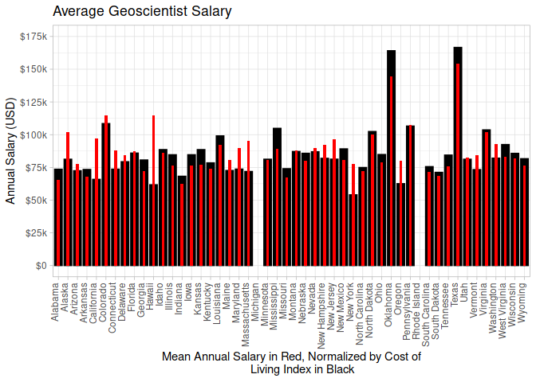
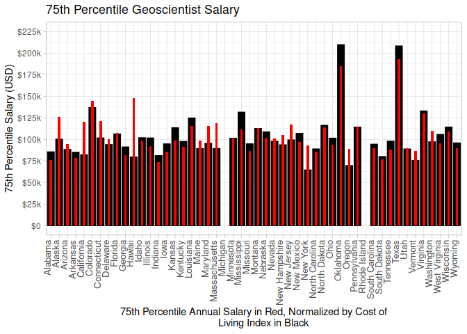
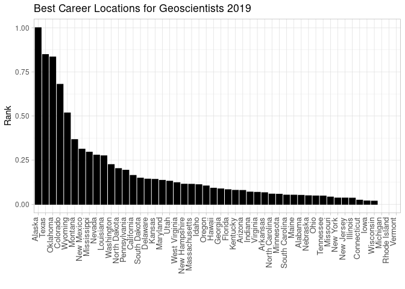

Geoscience Salary Survey
================
Robert LaBean

``` r
library(tidyverse)
library(readxl)
library(rvest)
```

Accessing the Bureau of Labor Statistics most current state salary data.

``` r
url <- "https://www.bls.gov/oes/special.requests/oesm19st.zip"

temp <- tempfile()
temp2 <- tempfile()

download.file(url, temp)
unzip(zipfile = temp, exdir = temp2)
raw_salary_data <- read_excel(file.path(temp2, "oesm19st/state_M2019_dl.xlsx"))

unlink(c(temp, temp2))
```

Next, we’re going to scrape the Missouri Economic Research and
Information Center (MERIC) web page an use their calculation for a cost
of living index. I like this calculation because they take the cost of
living index for each city in a state and average it to make a state
cost of living index.

``` r
scrape_url <- "https://meric.mo.gov/data/cost-living-data-series"
webpage <- read_html(scrape_url)
web_tables <- html_nodes(webpage, "table")
state_list <- html_table(web_tables)[[1]]

glimpse(state_list)
```

    ## Rows: 53
    ## Columns: 9
    ## $ State          <chr> "Mississippi", "Oklahoma", "Arkansas", "Kansas", "Miss…
    ## $ Rank           <chr> "1", "2", "3", "4", "5", "6", "7", "8", "9", "10", "11…
    ## $ Index          <dbl> 84.8, 86.8, 87.8, 87.9, 88.9, 89.4, 89.4, 89.6, 90.2, …
    ## $ Grocery        <dbl> 93.1, 94.1, 90.7, 92.8, 97.6, 99.0, 95.1, 99.7, 94.5, …
    ## $ Housing        <dbl> 66.7, 70.1, 75.2, 71.8, 71.6, 71.3, 70.2, 80.4, 82.6, …
    ## $ Utilities      <dbl> 91.8, 95.8, 92.7, 99.4, 97.5, 91.3, 103.3, 89.9, 92.2,…
    ## $ Transportation <dbl> 89.9, 91.3, 86.1, 94.8, 93.9, 97.0, 92.3, 93.0, 87.7, …
    ## $ Health         <dbl> 89.0, 93.1, 86.2, 98.4, 97.6, 97.5, 90.4, 98.2, 89.9, …
    ## $ Misc.          <dbl> 92.0, 92.5, 95.7, 92.3, 94.3, 96.2, 97.5, 90.8, 94.4, …

Now, I’m combining both data-sets into one. I’m also cleaning the data a
bit as we aren’t going to be needing a lot of the information from the
MERIC data-set

``` r
col_index <- filter(state_list, !grepl("District of Columbia|Puerto Rico|US", State)) %>%
  arrange(State)

salary_data <- inner_join(raw_salary_data, col_index, by = c("area_title" = "State")) %>%
  filter(occ_code == "19-2042") # This is the occupation code the BLS uses for Geoscientists

salary_data$normalized = as.numeric(salary_data$a_mean) / (salary_data$Index/100)
```

    ## Warning: NAs introduced by coercion

``` r
# Calculating the normalized 75th percentile salaries
salary_data$pct75_norm = as.numeric(salary_data$a_pct75) / (salary_data$Index/100)
```

    ## Warning: NAs introduced by coercion

``` r
# Here I'm creating a sort of 'ranking' system by 
# multiplying the normalized salary by the location
# quotient
salary_data$ranking = ((salary_data$normalized * as.numeric(salary_data$loc_quotient))) / as.numeric(max(salary_data$loc_quotient)) 
```

    ## Warning: NAs introduced by coercion

``` r
salary_data$rank2 <- salary_data$ranking / max(salary_data$ranking, na.rm = TRUE)

glimpse(col_index)
```

    ## Rows: 50
    ## Columns: 9
    ## $ State          <chr> "Alabama", "Alaska", "Arizona", "Arkansas", "Californi…
    ## $ Rank           <chr> "7", "45", "32", "3", "50", "35", "44", "36", "29", "6…
    ## $ Index          <dbl> 89.4, 128.0, 101.3, 87.8, 138.5, 105.0, 125.1, 107.9, …
    ## $ Grocery        <dbl> 95.1, 132.4, 99.4, 90.7, 117.3, 99.2, 107.7, 119.9, 10…
    ## $ Housing        <dbl> 70.2, 134.3, 102.0, 75.2, 196.5, 119.6, 142.2, 100.6, …
    ## $ Utilities      <dbl> 103.3, 159.5, 112.3, 92.7, 122.2, 87.6, 132.9, 94.6, 1…
    ## $ Transportation <dbl> 92.3, 117.8, 105.9, 86.1, 132.4, 101.5, 112.6, 103.6, …
    ## $ Health         <dbl> 90.4, 150.9, 96.9, 86.2, 112.7, 103.1, 110.5, 98.6, 97…
    ## $ Misc.          <dbl> 97.5, 112.8, 97.9, 95.7, 110.8, 101.7, 121.6, 114.7, 9…

Finally we’re going to normalize all the salaries with our cost of
living index and plot it on a chart to see which states typically have
the highest salaries compared to their respective cost of living.

``` r
salary_plot2 <- ggplot(salary_data) +
  theme_light(
  )+
  theme(
    axis.text.x = element_text(angle = 90,
                                   vjust = 0,
                                   hjust = 1),
        legend.position = "right"
    ) +
  labs(
    title = "Average Geoscientist Salary",
       y ="Annual Salary (USD)",
       x = "Mean Annual Salary in Red, Normalized by Cost of
       Living Index in Black"
    ) +
  geom_col(
    mapping = aes(area_title, normalized), 
           width = 0.8,
           fill = "black", 
           color = "black"
           ) +
  geom_col(
    mapping = aes(area_title, as.numeric(a_mean)),
           width = 0.3, 
           fill = "red"
           ) +
  scale_y_continuous(
    limits = c(0, 175000), 
                     breaks = seq(0, 175000, 25000), 
                     labels = c("0" = "$0", "25000" = "$25k", "50000" = "$50k", 
                                "75000" = "$75k", "100000" = "$100k", 
                                "125000" = "$125k", "150000" = "$150k", 
                                "175000" = "$175k")
    )
```

75th Percentile Plots - I added these plots because I was curious
whether California and New York might have much higher salaries than the
mean shows, but it didn’t change much.

``` r
salary_plot3 <- ggplot(salary_data) +
  theme_light(
  )+
  theme(
    axis.text.x = element_text(angle = 90,
                                   vjust = 0,
                                   hjust = 1, 
                               size = 10
                               ),
        legend.position = "right"
    ) +
  labs(
    title = "75th Percentile Geoscientist Salary",
       y ="75th Percentile Salary (USD)",
       x = "75th Percentile Annual Salary in Red, Normalized by Cost of
       Living Index in Black"
    ) +
  geom_col(
    mapping = aes(area_title, pct75_norm), 
           width = 0.8,
           fill = "black", 
           color = "black"
           ) +
  geom_col(
    mapping = aes(area_title, as.numeric(a_pct75)),
           width = 0.3, 
           fill = "red"
           ) +
  scale_y_continuous(
    limits = c(0, 225000), 
                     breaks = seq(0, 225000, 25000), 
                     labels = c("0" = "$0", "25000" = "$25k", "50000" = "$50k", 
                                "75000" = "$75k", "100000" = "$100k", 
                                "125000" = "$125k", "150000" = "$150k", 
                                "175000" = "$175k", "200000" = "$200k", "225000" = "$225k")
    )
```

Print plots

``` r
ggsave("salary_plot2.png", width = 20, height = 10, limitsize = FALSE)
```

    ## Warning in FUN(X[[i]], ...): NAs introduced by coercion

    ## Warning: Removed 2 rows containing missing values (position_stack).

    ## Warning: Removed 2 rows containing missing values (position_stack).

``` r
print(salary_plot2)
```

    ## Warning in FUN(X[[i]], ...): NAs introduced by coercion

    ## Warning in FUN(X[[i]], ...): Removed 2 rows containing missing values
    ## (position_stack).

    ## Warning in FUN(X[[i]], ...): Removed 2 rows containing missing values
    ## (position_stack).

<!-- -->

``` r
ggsave("salary_plot3.png", width = 20, height = 10, limitsize = FALSE)
```

    ## Warning in FUN(X[[i]], ...): NAs introduced by coercion

    ## Warning in FUN(X[[i]], ...): Removed 2 rows containing missing values
    ## (position_stack).

    ## Warning in FUN(X[[i]], ...): Removed 2 rows containing missing values
    ## (position_stack).

``` r
print(salary_plot3)
```

    ## Warning in FUN(X[[i]], ...): NAs introduced by coercion

    ## Warning in FUN(X[[i]], ...): Removed 2 rows containing missing values
    ## (position_stack).

    ## Warning in FUN(X[[i]], ...): Removed 2 rows containing missing values
    ## (position_stack).

<!-- -->

Here I attempted to make a sort of ‘ranking’ system, but the math
methodology could be better.

``` r
ranking_index = arrange(salary_data, rank2)

rank_plot1 <- ggplot(salary_data) +
  theme_light(
  )+
  theme(
    axis.text.x = element_text(angle = 90,
                                   vjust = 0,
                                   hjust = 1, 
                               size = 10
                               ),
        legend.position = "right"
    ) +
  labs(
    title = "Best Career Locations for Geoscientists 2019",
       y ="Rank",
       x = ""
    ) +
  geom_col(
    mapping = aes(x = reorder(area_title, -rank2), rank2),
           fill = "black", 
           color = "black",
    width = 0.8
           )
ggsave("rank_plot1.png", width = 20, height = 10, limitsize = FALSE)
```

    ## Warning: Removed 3 rows containing missing values (position_stack).

``` r
print(rank_plot1)
```

    ## Warning: Removed 3 rows containing missing values (position_stack).

<!-- -->
