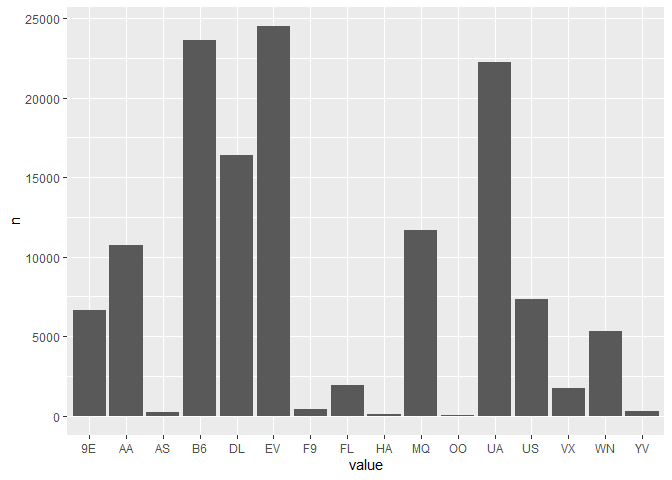
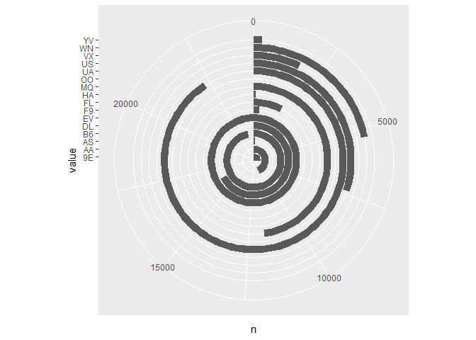
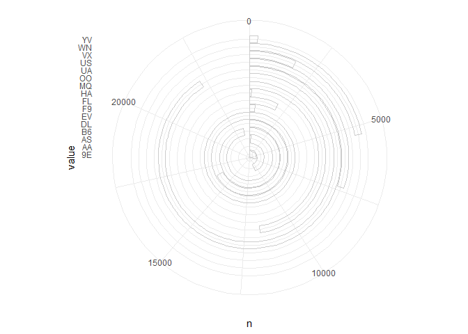
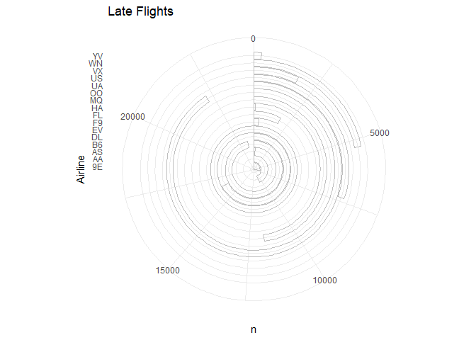
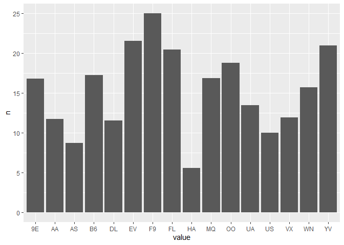
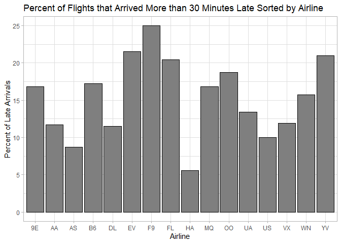

Good and Bad Plot Example
================
Robert LaBean

Anyone who has ever had a delayed flight knows how frustrating it can
be. Sitting in an airport when you’re trying to get to your vacation is
miserable. What if there was a way to statistically identify the airline
carrier that was most probable to have late flights? This way one could
purchase tickets and feel confident they were on a carrier that had a
track record of on time flights.

We’ll need the tidyverse and nycflights13 libraries for this.

``` r
library(tidyverse)
```

    ## -- Attaching packages -------------------------- tidyverse 1.3.0 --

    ## v ggplot2 3.3.2     v purrr   0.3.4
    ## v tibble  3.0.3     v dplyr   1.0.2
    ## v tidyr   1.1.2     v stringr 1.4.0
    ## v readr   1.3.1     v forcats 0.5.0

    ## -- Conflicts ----------------------------- tidyverse_conflicts() --
    ## x dplyr::filter() masks stats::filter()
    ## x dplyr::lag()    masks stats::lag()

``` r
library(nycflights13)
```

Let’s take a look at the nycflights13 data first.

``` r
glimpse(flights)
```

    ## Rows: 336,776
    ## Columns: 19
    ## $ year           <int> 2013, 2013, 2013, 2013, 2013, 2013, 2013, 2013, 2013...
    ## $ month          <int> 1, 1, 1, 1, 1, 1, 1, 1, 1, 1, 1, 1, 1, 1, 1, 1, 1, 1...
    ## $ day            <int> 1, 1, 1, 1, 1, 1, 1, 1, 1, 1, 1, 1, 1, 1, 1, 1, 1, 1...
    ## $ dep_time       <int> 517, 533, 542, 544, 554, 554, 555, 557, 557, 558, 55...
    ## $ sched_dep_time <int> 515, 529, 540, 545, 600, 558, 600, 600, 600, 600, 60...
    ## $ dep_delay      <dbl> 2, 4, 2, -1, -6, -4, -5, -3, -3, -2, -2, -2, -2, -2,...
    ## $ arr_time       <int> 830, 850, 923, 1004, 812, 740, 913, 709, 838, 753, 8...
    ## $ sched_arr_time <int> 819, 830, 850, 1022, 837, 728, 854, 723, 846, 745, 8...
    ## $ arr_delay      <dbl> 11, 20, 33, -18, -25, 12, 19, -14, -8, 8, -2, -3, 7,...
    ## $ carrier        <chr> "UA", "UA", "AA", "B6", "DL", "UA", "B6", "EV", "B6"...
    ## $ flight         <int> 1545, 1714, 1141, 725, 461, 1696, 507, 5708, 79, 301...
    ## $ tailnum        <chr> "N14228", "N24211", "N619AA", "N804JB", "N668DN", "N...
    ## $ origin         <chr> "EWR", "LGA", "JFK", "JFK", "LGA", "EWR", "EWR", "LG...
    ## $ dest           <chr> "IAH", "IAH", "MIA", "BQN", "ATL", "ORD", "FLL", "IA...
    ## $ air_time       <dbl> 227, 227, 160, 183, 116, 150, 158, 53, 140, 138, 149...
    ## $ distance       <dbl> 1400, 1416, 1089, 1576, 762, 719, 1065, 229, 944, 73...
    ## $ hour           <dbl> 5, 5, 5, 5, 6, 5, 6, 6, 6, 6, 6, 6, 6, 6, 6, 5, 6, 6...
    ## $ minute         <dbl> 15, 29, 40, 45, 0, 58, 0, 0, 0, 0, 0, 0, 0, 0, 0, 59...
    ## $ time_hour      <dttm> 2013-01-01 05:00:00, 2013-01-01 05:00:00, 2013-01-0...

It looks like the information we need is right there. This table has
listing for carrier, arrival delay, and departure delay.

Let’s make a plot that shows the carriers, and the count of their
respective flights that arrive at their destination late (because
vacation is about spending the most amount of time away, right?).

``` r
late_carriers <- filter(flights, arr_delay > 0) %>%
  select("carrier", "arr_delay") %>%
  pivot_longer("carrier") %>%
  count(value)
# This selects only the flights that arrived >0 minutes late
# and sums the number of times each carrier appears
glimpse(late_carriers)
```

    ## Rows: 16
    ## Columns: 2
    ## $ value <chr> "9E", "AA", "AS", "B6", "DL", "EV", "F9", "FL", "HA", "MQ", "...
    ## $ n     <int> 6637, 10706, 189, 23609, 16413, 24484, 392, 1895, 97, 11693, ...

So, we have a listing of the carriers, and how many times they had a
flight that arrived late in 2013. Let’s turn this into a plot.

``` r
bad_plot <- ggplot(data = late_carriers) +
  geom_col(mapping = aes(x = value, y = n))
print(bad_plot)
```

<!-- -->

Ok, not so bad. You can see that carrier EV had the most late flights,
and carrier OO had the least. We can do worse than this though. Let’s
try to keep the exact same data, and the overall ‘style’ of the plot and
make it very hard to easily read.

``` r
bad_plot <- ggplot(data = late_carriers) +
  geom_col(mapping = aes(x = value, y = n)) + 
  coord_polar("y", start = 0)
print(bad_plot)
```

<!-- -->

Ok, plotting on a polar coordinate system is terrible, let’s try and
make it worse with some terrible colors. Since this is a print
publication we went with all gray-scale colors and, since our ink budget
is pretty low, we will go with a minimal background, and just the
outlines of the bars.

``` r
bad_plot <- ggplot(data = late_carriers, c = colors()) +
  geom_col(mapping = aes(x = value, y = n), fill = "NA", colour = "grey80") + 
  theme_minimal() + 
  coord_polar("y", start = 0) 
print(bad_plot)
```

<!-- -->

Now we just need some titles and this plot will be perfect.

``` r
bad_plot <- ggplot(data = late_carriers, c = colors()) +
  geom_col(mapping = aes(x = value, y = n), fill = "NA", colour = "grey75") + 
  theme_minimal() + 
  ggtitle("Late Flights") + 
  xlab("Airline") + 
  coord_polar("y", start = 0) 
print(bad_plot)
```

<!-- -->

Ok here we have a terribly hard to understand plot now. Let’s try and do
this better. Let’s go back to the original bar plot.

``` r
bad_plot <- ggplot(data = late_carriers) +
  geom_col(mapping = aes(x = value, y = n))
print(bad_plot)
```

<!-- -->

This isn’t terrible, but the data isn’t great. Just because one airline
has more late flights doesn’t mean much. They could also be operating a
much larger fleet. Secondly, setting our ‘late’ data-point at \>0
minutes past arrival date is a bit sensitive. Let’s try and come up with
a better way to calculate how late a certain airline is. Let’s start
with selecting the carriers that all had arrivals more than 30 minutes
late.

``` r
late_flights <- filter(flights, arr_delay > 30) %>%
  select("carrier", "arr_delay") %>%
  pivot_longer("carrier") %>%
  count(value)
glimpse(late_flights)  
```

    ## Rows: 16
    ## Columns: 2
    ## $ value <chr> "9E", "AA", "AS", "B6", "DL", "EV", "F9", "FL", "HA", "MQ", "...
    ## $ n     <int> 3099, 3827, 62, 9421, 5533, 11666, 171, 665, 19, 4437, 6, 787...

Selecting 30 minutes is a bit more reasonable for a late flight. Let’s
also normalize by calculating the percent of the airlines total flights
that were late.

``` r
glimpse(flights)
```

    ## Rows: 336,776
    ## Columns: 19
    ## $ year           <int> 2013, 2013, 2013, 2013, 2013, 2013, 2013, 2013, 2013...
    ## $ month          <int> 1, 1, 1, 1, 1, 1, 1, 1, 1, 1, 1, 1, 1, 1, 1, 1, 1, 1...
    ## $ day            <int> 1, 1, 1, 1, 1, 1, 1, 1, 1, 1, 1, 1, 1, 1, 1, 1, 1, 1...
    ## $ dep_time       <int> 517, 533, 542, 544, 554, 554, 555, 557, 557, 558, 55...
    ## $ sched_dep_time <int> 515, 529, 540, 545, 600, 558, 600, 600, 600, 600, 60...
    ## $ dep_delay      <dbl> 2, 4, 2, -1, -6, -4, -5, -3, -3, -2, -2, -2, -2, -2,...
    ## $ arr_time       <int> 830, 850, 923, 1004, 812, 740, 913, 709, 838, 753, 8...
    ## $ sched_arr_time <int> 819, 830, 850, 1022, 837, 728, 854, 723, 846, 745, 8...
    ## $ arr_delay      <dbl> 11, 20, 33, -18, -25, 12, 19, -14, -8, 8, -2, -3, 7,...
    ## $ carrier        <chr> "UA", "UA", "AA", "B6", "DL", "UA", "B6", "EV", "B6"...
    ## $ flight         <int> 1545, 1714, 1141, 725, 461, 1696, 507, 5708, 79, 301...
    ## $ tailnum        <chr> "N14228", "N24211", "N619AA", "N804JB", "N668DN", "N...
    ## $ origin         <chr> "EWR", "LGA", "JFK", "JFK", "LGA", "EWR", "EWR", "LG...
    ## $ dest           <chr> "IAH", "IAH", "MIA", "BQN", "ATL", "ORD", "FLL", "IA...
    ## $ air_time       <dbl> 227, 227, 160, 183, 116, 150, 158, 53, 140, 138, 149...
    ## $ distance       <dbl> 1400, 1416, 1089, 1576, 762, 719, 1065, 229, 944, 73...
    ## $ hour           <dbl> 5, 5, 5, 5, 6, 5, 6, 6, 6, 6, 6, 6, 6, 6, 6, 5, 6, 6...
    ## $ minute         <dbl> 15, 29, 40, 45, 0, 58, 0, 0, 0, 0, 0, 0, 0, 0, 0, 59...
    ## $ time_hour      <dttm> 2013-01-01 05:00:00, 2013-01-01 05:00:00, 2013-01-0...

``` r
late_flights <- filter(flights, arr_delay > 30) %>%
  select("carrier", "arr_delay") %>%
  pivot_longer("carrier") %>%
  count(value) # Here we are selecting flights with greater than 30 minute delay and counting the occurrences
glimpse(late_flights)  
```

    ## Rows: 16
    ## Columns: 2
    ## $ value <chr> "9E", "AA", "AS", "B6", "DL", "EV", "F9", "FL", "HA", "MQ", "...
    ## $ n     <int> 3099, 3827, 62, 9421, 5533, 11666, 171, 665, 19, 4437, 6, 787...

``` r
total_flights <- select(flights, "carrier") %>%
  pivot_longer("carrier") %>%
  count(value)

percent_late_arr <- 
  select(late_flights, n)/select(total_flights, n)*100 # This is to calculate the percentage 
# of flights that were late by >30 minutes for each carrier
late_arr <- bind_cols(select(total_flights, "value"), 
                     percent_late_arr)
glimpse(late_arr)
```

    ## Rows: 16
    ## Columns: 2
    ## $ value <chr> "9E", "AA", "AS", "B6", "DL", "EV", "F9", "FL", "HA", "MQ", "...
    ## $ n     <dbl> 16.787649, 11.692994, 8.683473, 17.243525, 11.500727, 21.5347...

So, now we have our data, arrivals greater than 30 minutes late
normalized as a percentage of total carrier traffic. Let’s put this data
into the first ‘bad plot’ we made.

``` r
good_plot <- ggplot(data = late_arr) +
  geom_col(mapping = aes(x = value, y = n))
print(good_plot)
```

<!-- -->

This is getting to a point where the data makes sense. Let’s pretty this
up and make it a bit nicer.

``` r
good_plot <- ggplot(data = late_arr, c = colors()) +
  geom_col(mapping = aes(x = value, y = n), fill = "grey50", color = "black") +
  theme_light() +
  xlab("Airline") +
  ylab("Percent of Late Arrivals") +
  ggtitle("Percent of Flights that Arrived More than 30 Minutes Late Sorted by Airline")
print(good_plot)
```

<!-- -->
