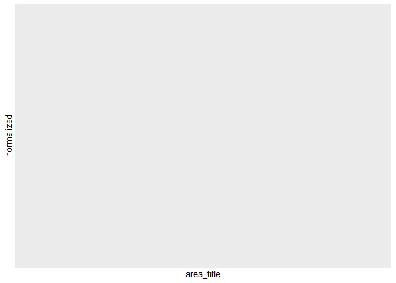

Homework 09
================
Robert LaBean

``` r
library(tidyverse)
```

    ## -- Attaching packages --------------------------------------- tidyverse 1.3.0 --

    ## v ggplot2 3.3.2     v purrr   0.3.4
    ## v tibble  3.0.4     v dplyr   1.0.2
    ## v tidyr   1.1.2     v stringr 1.4.0
    ## v readr   1.4.0     v forcats 0.5.0

    ## -- Conflicts ------------------------------------------ tidyverse_conflicts() --
    ## x dplyr::filter() masks stats::filter()
    ## x dplyr::lag()    masks stats::lag()

First, let’s write the equations for variance.

# `{r} #  # variance <- function(x, sample_mean){ #   varx <- (1/(x-1))*sum(1:x)*() # } #  #`

``` r
normalize_salary <- function(occ_code) {
  library(readxl)
  salary_data <- read_xlsx("data/state_M2019_dl.xlsx") %>%
  filter(occ_code == "occ_code") %>%
  select(area_title, a_mean)
  col_index <- read.csv("data/col_index.csv", fileEncoding = "UTF-8-BOM")
norm_salary_data <- left_join(salary_data, col_index)
norm_salary_data$normalized = as.numeric(norm_salary_data$a_mean) / norm_salary_data$index

salary_plot <- ggplot(norm_salary_data) + 
  geom_col(mapping = aes(area_title, normalized))+
  theme(axis.text.x = element_text(angle = 45))
print(salary_plot)
}
```

Running our function

``` r
normalize_salary(11-3131)
```

    ## Joining, by = "area_title"

<!-- -->
