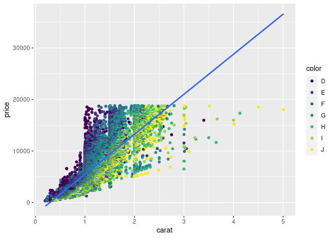

Homework 10
================
Robert LaBean

``` r
library(tidyverse)
```

1.  

Using the `diamonds` dataset, create a linear model of price as a
function of the weight of the diamond (`carat`). According to that
model, what price would you expect for a 1-carat diamond?

``` r
lm_diamonds <- lm(diamonds$price ~ diamonds$carat)
summary(lm_diamonds)
```

    ## 
    ## Call:
    ## lm(formula = diamonds$price ~ diamonds$carat)
    ## 
    ## Residuals:
    ##      Min       1Q   Median       3Q      Max 
    ## -18585.3   -804.8    -18.9    537.4  12731.7 
    ## 
    ## Coefficients:
    ##                Estimate Std. Error t value Pr(>|t|)    
    ## (Intercept)    -2256.36      13.06  -172.8   <2e-16 ***
    ## diamonds$carat  7756.43      14.07   551.4   <2e-16 ***
    ## ---
    ## Signif. codes:  0 '***' 0.001 '**' 0.01 '*' 0.05 '.' 0.1 ' ' 1
    ## 
    ## Residual standard error: 1549 on 53938 degrees of freedom
    ## Multiple R-squared:  0.8493, Adjusted R-squared:  0.8493 
    ## F-statistic: 3.041e+05 on 1 and 53938 DF,  p-value: < 2.2e-16

1.  

Now create a linear model of `price` as a function of `carat` and
`color`.

``` r
lm_diamonds2 <- lm(diamonds$price ~ diamonds$carat + diamonds$color)
summary(lm_diamonds2)
```

    ## 
    ## Call:
    ## lm(formula = diamonds$price ~ diamonds$carat + diamonds$color)
    ## 
    ## Residuals:
    ##      Min       1Q   Median       3Q      Max 
    ## -18345.1   -765.8    -72.8    558.5  12288.9 
    ## 
    ## Coefficients:
    ##                  Estimate Std. Error  t value Pr(>|t|)    
    ## (Intercept)      -2702.23      13.78 -196.054  < 2e-16 ***
    ## diamonds$carat    8066.62      14.04  574.558  < 2e-16 ***
    ## diamonds$color.L -1572.20      22.32  -70.445  < 2e-16 ***
    ## diamonds$color.Q  -741.14      20.40  -36.333  < 2e-16 ***
    ## diamonds$color.C  -122.70      19.15   -6.409 1.48e-10 ***
    ## diamonds$color^4    78.77      17.58    4.480 7.49e-06 ***
    ## diamonds$color^5  -144.74      16.62   -8.707  < 2e-16 ***
    ## diamonds$color^6  -180.75      15.08  -11.988  < 2e-16 ***
    ## ---
    ## Signif. codes:  0 '***' 0.001 '**' 0.01 '*' 0.05 '.' 0.1 ' ' 1
    ## 
    ## Residual standard error: 1472 on 53932 degrees of freedom
    ## Multiple R-squared:  0.864,  Adjusted R-squared:  0.8639 
    ## F-statistic: 4.893e+04 on 7 and 53932 DF,  p-value: < 2.2e-16

``` r
# I'm doing two models to see what the difference in coercing diamonds$color 
# into a character vector first has. 

lm_diamonds3 <- lm(diamonds$price ~ diamonds$carat + as.character(diamonds$color))
summary(lm_diamonds2)
```

    ## 
    ## Call:
    ## lm(formula = diamonds$price ~ diamonds$carat + diamonds$color)
    ## 
    ## Residuals:
    ##      Min       1Q   Median       3Q      Max 
    ## -18345.1   -765.8    -72.8    558.5  12288.9 
    ## 
    ## Coefficients:
    ##                  Estimate Std. Error  t value Pr(>|t|)    
    ## (Intercept)      -2702.23      13.78 -196.054  < 2e-16 ***
    ## diamonds$carat    8066.62      14.04  574.558  < 2e-16 ***
    ## diamonds$color.L -1572.20      22.32  -70.445  < 2e-16 ***
    ## diamonds$color.Q  -741.14      20.40  -36.333  < 2e-16 ***
    ## diamonds$color.C  -122.70      19.15   -6.409 1.48e-10 ***
    ## diamonds$color^4    78.77      17.58    4.480 7.49e-06 ***
    ## diamonds$color^5  -144.74      16.62   -8.707  < 2e-16 ***
    ## diamonds$color^6  -180.75      15.08  -11.988  < 2e-16 ***
    ## ---
    ## Signif. codes:  0 '***' 0.001 '**' 0.01 '*' 0.05 '.' 0.1 ' ' 1
    ## 
    ## Residual standard error: 1472 on 53932 degrees of freedom
    ## Multiple R-squared:  0.864,  Adjusted R-squared:  0.8639 
    ## F-statistic: 4.893e+04 on 7 and 53932 DF,  p-value: < 2.2e-16

1.  

Make some plots of the raw data, and of the model fits, to make an
argument as to which model is more useful.

``` r
diam_plot_pc <- ggplot(diamonds) + 
  geom_point(mapping = aes(x = carat, y = price, colour = color)) +
  geom_smooth(method ='lm', mapping = aes(x = carat, y = price))

print(diam_plot_pc)
```

<!-- -->

1.  

Write a function that returns some kind of structured result, which you
define as a new S3 class. Your class doesn’t need to be anything fancy,
but it should be different from existing classes.

``` r
good_couch <- function(
  is_comfy = TRUE, 
  my_favorite = "by window"
){

couch <- list(
  has_cushion = is_comfy, 
  favorite_spot = my_favorite
)

class(couch) <- append(class(couch), "good_couch")
return(couch)
}
my_couch <- good_couch()
my_couch
```

    ## $has_cushion
    ## [1] TRUE
    ## 
    ## $favorite_spot
    ## [1] "by window"
    ## 
    ## attr(,"class")
    ## [1] "list"       "good_couch"

1.  

Write `print` and `summarise` methods for this class. These methods
don’t need to be particularly useful, but they should be different from
the default methods.

``` r
print.good_couch <- function(x){
  cat("Print good_couch")
}
print(my_couch)
```

    ## Print good_couch

``` r
summarise.good_couch <- function(x){
  cat("summarise good_couch")
}

summarise(my_couch)
```

    ## summarise good_couch
